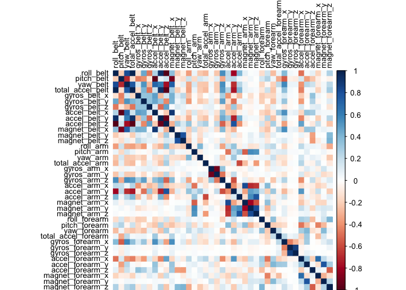
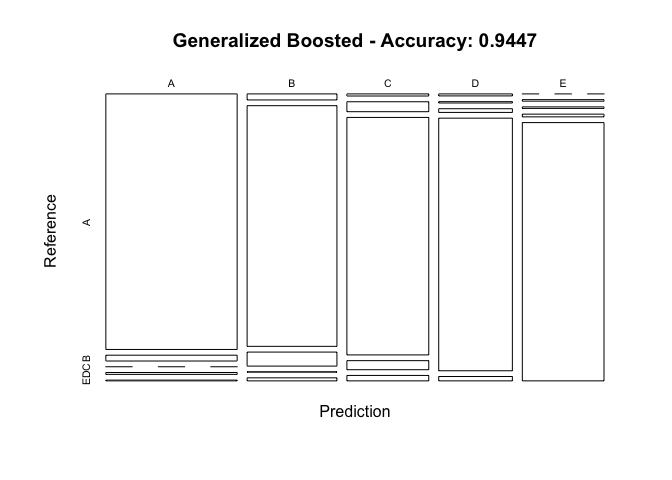

Machine learning project
================
Micky Chi
28 July, 2017

Overview
--------

This is the report for the final project of Coursera's course Practical Machine Learning. It was written in R markdown file and published in html format. The goal of the project is to predict the manner in which people do exercises using data from accelerometers on the belt, forearm, arm, and dumbell of 6 participants.

Background Information
----------------------

Using devices such as Jawbone Up, Nike FuelBand, and Fitbit it is now possible to collect a large amount of data about personal activity relatively inexpensively. These type of devices are part of the quantified self movement – a group of enthusiasts who take measurements about themselves regularly to improve their health, to find patterns in their behavior, or because they are tech geeks. One thing that people regularly do is quantify how much of a particular activity they do, but they rarely quantify how well they do it. In this project, your goal will be to use data from accelerometers on the belt, forearm, arm, and dumbell of 6 participants. They were asked to perform barbell lifts correctly and incorrectly in 5 different ways. More information is available from the website here: <http://groupware.les.inf.puc-rio.br/har> (see the section on the Weight Lifting Exercise Dataset).

Data and Exploratory Analysis
-----------------------------

### Data Source

Data can be downloaded using the following links

[Training Data](https://d396qusza40orc.cloudfront.net/predmachlearn/pml-training.csv) [Testing Data](https://d396qusza40orc.cloudfront.net/predmachlearn/pml-testing.csv) The data for this project come from this source: <http://groupware.les.inf.puc-rio.br/har>.

### Environment Preparation

Load all the R packages necessary for the entire analysis.

``` r
library(caret)
library(rattle)
library(rpart)
library(randomForest)
library(corrplot)
library(rpart.plot)
library(gbm)
set.seed(1994)
```

### Download Data

Next we will download the data from the web. The training dataset would be partitioned into a training set, which is 3/4 of the original data set, with the remaining belongs to a testing set which would be used for validations. The testing dataset won't be used for any model refinements.

``` r
training <- read.csv("https://d396qusza40orc.cloudfront.net/predmachlearn/pml-training.csv")
testing <- read.csv("https://d396qusza40orc.cloudfront.net/predmachlearn/pml-testing.csv")
# Partition the trainint dataset with the outcome variable
inTrain <- createDataPartition(training$classe, p = 3/4, list = FALSE)
train <- training[inTrain,]
test <- training[-inTrain,]
```

### Data cleaning

Let's take a look at the data.

``` r
dim(train)
```

    ## [1] 14718   160

``` r
dim(test)
```

    ## [1] 4904  160

There are 160 variables in the dataset which is apparently too many for a valid analysis. So here we make a more detailed analysis on the variables. First we remove variables with more than 80% NAs.

``` r
NAs <- sapply(train, function(x) mean(is.na(x))) > 0.9
train <- train[, NAs==FALSE]
test <- test[, NAs==FALSE]
dim(train)
```

    ## [1] 14718    93

Next we remove those variables with almost zero variance.

``` r
NZVs <- nearZeroVar(train)
train <- train[, -NZVs]
test <- test[, -NZVs]
dim(train)
```

    ## [1] 14718    59

We also need to remove those variables that serves only identification purposes, such as variables about identification number, user names, and timing.

``` r
train <- train[, -(1:5)]
test <- test[, -(1:5)]
dim(train)
```

    ## [1] 14718    54

The requirement of the project is to use data from accelerometers on the belt, forearm, arm, and dumbell to make predictions, so now we filter those related variables.

``` r
filter <- grepl("belt|arm|forearm|dumbell", names(train))
class1 <- train$classe
class2 <- test$classe
train <- cbind(train[,filter],class1)
test <- as.data.frame(cbind(test[, filter],class2))
train$class1 <- as.factor(train$class1)
test$class2 <- as.factor(test$class2)
dim(train)
```

    ## [1] 14718    40

### Correlation Analysis

``` r
cor <- cor(train[, -40])
corrplot(cor, method = "color", tl.col = rgb(0,0,0), tl.cex = 0.8)
```



Dark colors mean high correlation. From the plot, we can see that there are relatively few squares with dark color, so the correlation between predictors are comparatively weak.

Prediction Models
-----------------

### Decision Trees

``` r
set.seed(1994)
fit1 <- rpart(class1~., method = "class", data = train)
fancyRpartPlot(fit1)
```


``` r
pre1 <- predict(fit1, newdata = test, type = "class")
con1 <- confusionMatrix(pre1, test$class2)
con1
```

    ## Confusion Matrix and Statistics
    ## 
    ##           Reference
    ## Prediction    A    B    C    D    E
    ##          A 1103   88    4   18    2
    ##          B  152  515   95   40   47
    ##          C   43  222  616   71   97
    ##          D   79   59   86  619  123
    ##          E   18   65   54   56  632
    ## 
    ## Overall Statistics
    ##                                           
    ##                Accuracy : 0.7106          
    ##                  95% CI : (0.6977, 0.7233)
    ##     No Information Rate : 0.2845          
    ##     P-Value [Acc > NIR] : < 2.2e-16       
    ##                                           
    ##                   Kappa : 0.6363          
    ##  Mcnemar's Test P-Value : < 2.2e-16       
    ## 
    ## Statistics by Class:
    ## 
    ##                      Class: A Class: B Class: C Class: D Class: E
    ## Sensitivity            0.7907   0.5427   0.7205   0.7699   0.7014
    ## Specificity            0.9681   0.9155   0.8931   0.9154   0.9518
    ## Pos Pred Value         0.9078   0.6066   0.5872   0.6408   0.7661
    ## Neg Pred Value         0.9208   0.8930   0.9380   0.9530   0.9341
    ## Prevalence             0.2845   0.1935   0.1743   0.1639   0.1837
    ## Detection Rate         0.2249   0.1050   0.1256   0.1262   0.1289
    ## Detection Prevalence   0.2478   0.1731   0.2139   0.1970   0.1682
    ## Balanced Accuracy      0.8794   0.7291   0.8068   0.8426   0.8266

``` r
plot(con1$table, col = con1$byClass, main = paste("Decision Tree - Accuracy:", round(con1$overall["Accuracy"], 4)))
```


### Random Forests

``` r
train$class1 <- as.factor(train$class1)
test$class2 <- as.factor(test$class2)
fit2 <- randomForest(class1~., data = train)
pre2 <- predict(fit2, newdata = test, type = "class")
con2 <- confusionMatrix(pre2, test$class2)
con2
```

    ## Confusion Matrix and Statistics
    ## 
    ##           Reference
    ## Prediction    A    B    C    D    E
    ##          A 1391    1    0    1    0
    ##          B    1  945   13    0    0
    ##          C    2    3  836    7    0
    ##          D    1    0    6  794    3
    ##          E    0    0    0    2  898
    ## 
    ## Overall Statistics
    ##                                           
    ##                Accuracy : 0.9918          
    ##                  95% CI : (0.9889, 0.9942)
    ##     No Information Rate : 0.2845          
    ##     P-Value [Acc > NIR] : < 2.2e-16       
    ##                                           
    ##                   Kappa : 0.9897          
    ##  Mcnemar's Test P-Value : NA              
    ## 
    ## Statistics by Class:
    ## 
    ##                      Class: A Class: B Class: C Class: D Class: E
    ## Sensitivity            0.9971   0.9958   0.9778   0.9876   0.9967
    ## Specificity            0.9994   0.9965   0.9970   0.9976   0.9995
    ## Pos Pred Value         0.9986   0.9854   0.9858   0.9876   0.9978
    ## Neg Pred Value         0.9989   0.9990   0.9953   0.9976   0.9993
    ## Prevalence             0.2845   0.1935   0.1743   0.1639   0.1837
    ## Detection Rate         0.2836   0.1927   0.1705   0.1619   0.1831
    ## Detection Prevalence   0.2841   0.1956   0.1729   0.1639   0.1835
    ## Balanced Accuracy      0.9983   0.9961   0.9874   0.9926   0.9981

``` r
plot(con2$table, col = con2$byClass, main = paste("Random Forest - Accuracy:", round(con2$overall["Accuracy"], 4)))
```


### Generalized Boosted Model

``` r
set.seed(1994)
fit3 <- train(class1~., data = train, method = "gbm", verbose = FALSE)
pre3 <- predict(fit3, newdata = test)
con3 <- confusionMatrix(pre3, test$class2)
con3
```

    ## Confusion Matrix and Statistics
    ## 
    ##           Reference
    ## Prediction    A    B    C    D    E
    ##          A 1360   31    0   10    4
    ##          B   22  876   51    1   11
    ##          C    7   33  788   30   18
    ##          D    6    4   11  754   13
    ##          E    0    5    5    9  855
    ## 
    ## Overall Statistics
    ##                                         
    ##                Accuracy : 0.9447        
    ##                  95% CI : (0.938, 0.951)
    ##     No Information Rate : 0.2845        
    ##     P-Value [Acc > NIR] : < 2.2e-16     
    ##                                         
    ##                   Kappa : 0.9301        
    ##  Mcnemar's Test P-Value : 3.344e-05     
    ## 
    ## Statistics by Class:
    ## 
    ##                      Class: A Class: B Class: C Class: D Class: E
    ## Sensitivity            0.9749   0.9231   0.9216   0.9378   0.9489
    ## Specificity            0.9872   0.9785   0.9783   0.9917   0.9953
    ## Pos Pred Value         0.9680   0.9116   0.8995   0.9569   0.9783
    ## Neg Pred Value         0.9900   0.9815   0.9834   0.9879   0.9886
    ## Prevalence             0.2845   0.1935   0.1743   0.1639   0.1837
    ## Detection Rate         0.2773   0.1786   0.1607   0.1538   0.1743
    ## Detection Prevalence   0.2865   0.1960   0.1786   0.1607   0.1782
    ## Balanced Accuracy      0.9810   0.9508   0.9500   0.9648   0.9721

``` r
plot(con3$table, col = con3$byClass, main = paste("Generalized Boosted - Accuracy:", round(con3$overall["Accuracy"], 4)))
```



Model Validation
----------------

Comparing the accuracy of the three models, we select the method of random forest.

``` r
predict(fit2, newdata = testing)
```

    ##  1  2  3  4  5  6  7  8  9 10 11 12 13 14 15 16 17 18 19 20 
    ##  B  A  B  A  A  E  D  B  A  A  B  C  B  A  E  E  A  B  B  B 
    ## Levels: A B C D E
